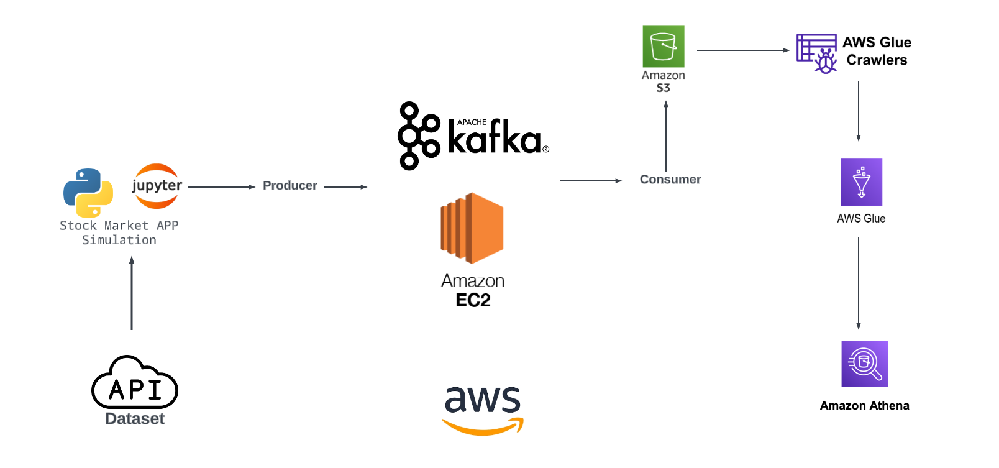
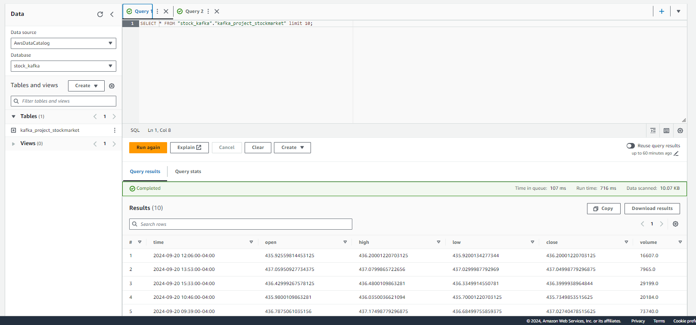
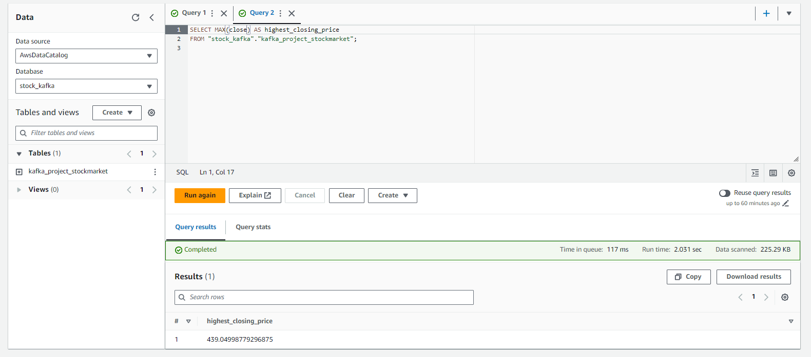

# Real-Time Stock Market Data Streaming and Analysis with Kafka, AWS S3, Glue, and Athena

## Overview

This project showcases a real-time data streaming and analysis pipeline for stock market data using a combination of **Apache Kafka**, **AWS S3**, **AWS Glue**, and **Amazon Athena**. Leveraging the powerful data extraction capabilities of **yFinance API**, the system is designed to simulate and analyze stock market data in near real-time, making it highly useful for financial applications, algorithmic trading, or monitoring market trends.

The architecture of the solution enables seamless ingestion, processing, and querying of streaming data, giving users the ability to perform real-time analytics on stock data.

## Architecture

### 1. **Stock Market Data Simulation via yFinance API**

   The data is sourced from **yFinance API**. Using Python scripts, the stock market data is fetched at regular intervals, simulating a real-time stream of stock prices and financial indicators. The simulation is initiated and managed through a **Jupyter Notebook** for ease of prototyping and analysis.

### 2. **Data Ingestion with Apache Kafka**

   The real-time data from the stock market simulation is then pushed into an **Apache Kafka** producer hosted on an **Amazon EC2** instance. Kafka, a distributed streaming platform, is responsible for handling the data stream reliably and efficiently, ensuring that the stock data is continuously streamed.

### 3. **Storage on AWS S3**

   A Kafka consumer is set up to retrieve the stock data and store it in **Amazon S3** buckets. By leveraging S3, the system ensures that the data is persistently stored in a highly scalable, secure, and durable storage solution.

### 4. **Data Cataloging with AWS Glue**

   **AWS Glue Crawlers** are used to automatically detect the schema of the raw stock market data stored in S3 and catalog it for future queries. **AWS Glue** simplifies the ETL (Extract, Transform, Load) process by creating a meta-data catalog of the data in an organized and searchable way.

### 5. **Querying with Amazon Athena**

   Once the data is cataloged, it is queried in near real-time using **Amazon Athena**. Athena provides serverless querying capabilities that allow users to perform SQL-based queries directly on the data stored in S3. This enables quick and efficient analysis of stock prices, trends, and patterns as new data arrives.

---

## Features

- **Real-Time Data Streaming**: Fetching real-time stock market data using **yFinance API** and streaming it through **Kafka**.
- **Scalable and Reliable**: Data storage on **Amazon S3** ensures scalability, while Kafka ensures reliability in streaming.
- **Automated Data Cataloging**: With **AWS Glue**, the project automatically organizes data and makes it queryable.
- **Serverless Data Analysis**: **Amazon Athena** allows for running SQL queries on live data without managing infrastructure.
- **Near-Real-Time Analytics**: Perform data analysis and gain insights into stock market trends and movements with minimal delay.

---

## Technoligies Used

- Amazon Web Services (AWS)
- EC2
- Apache Kafka
- Glue Crawler
- Glue Catalouge
- AWS Athena
- Python
- Jupyter Notebook

## Output Examples

Below are examples of the final output from the stock market data pipeline.

### 1. Query Results for Stock Data

This image shows a snapshot of querying the stock market data, with stock prices and other metrics such as opening, closing, and volume.

### 2. Highest Closing Price Query Output

This image shows the result of querying the highest closing price from the stock market data.
